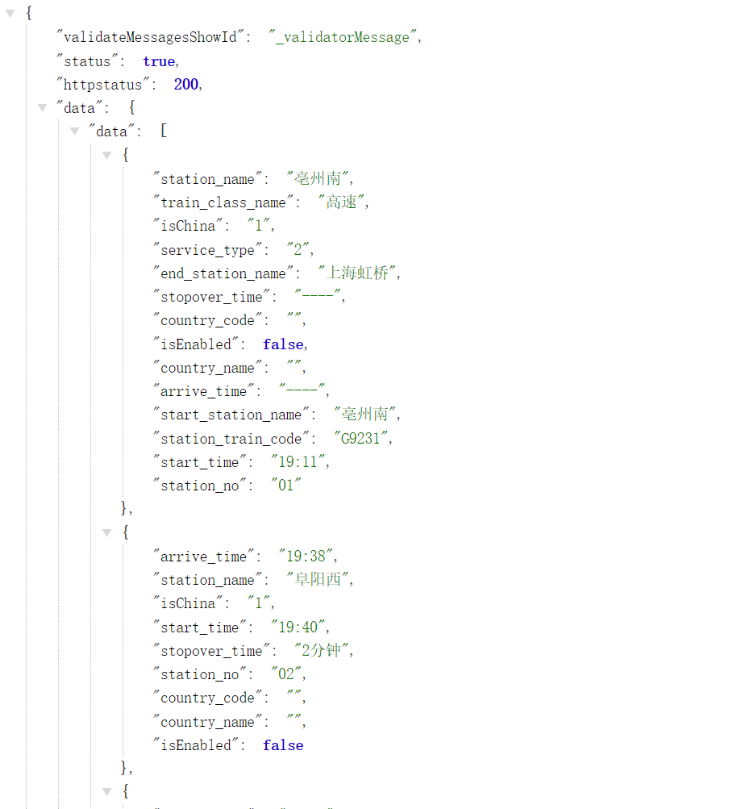

# 一、站点车次列表URL
**站点车次列表URL分析**
```tex
https://kyfw.12306.cn/otn/leftTicket/query?leftTicketDTO.train_date=2024-09-09&leftTicketDTO.from_station=HFH&leftTicketDTO.to_station=SHH&purpose_codes=ADULT
```
**变量使用#{parameter}标注**
```tex
https://kyfw.12306.cn/otn/leftTicket/query?leftTicketDTO.train_date=#{train_date}&leftTicketDTO.from_station=#{from_station}&leftTicketDTO.to_station=#{to_station}&purpose_codes=ADULT
```
通过上面的格式即可以得到车次列表的URL，然后使用station_info里的station_code进行替换，日期随便使用一个即可得到车次列表的URL。得到这个车次列表的信息后，我们可以解析当前车次的数据。
得到车次列表的url后，访问该URL可以得到下面格式的数据


这个数据可以使用JSON格式解析，得到车次列表的详细信息。只需要关注data里的result部分数据即可。取出result中的一行数据进行分析。
```text
"8pXApdNa%2FThSN9c5CAclJL4628WdQ7nB0udBmD3EgRxIMaZN21yxFr8W1E1vrNb%2B0%2Fe%2FY5ke5zEs%0AaFiM7x4UW3WOGYTUI2EXNLFiYyTmYNAA0aSePBVwNpU2hlZjuI83g5SdUlQnLGSRceKrDOOHHYyg%0AQ7X%2FX%2Fk37UqjAkCtippVyS5g38r%2B26njsH277WF1GbIh0Uk%2FsTQtAsuBXBRYeJHmqZ75IBvN1RK5%0ABkLcHldv41DW19NMASd%2FgCBo1uEHwh78ro9Lyll%2BeJFIqQAnT2bkVziSKK6tVN2nVukdrh66o8AE%0A3RW1FhCiaEe3of9qIxQLkT1B3offK5%2FixI5UjX4P7M1ef6Ip90zyzw%3D%3D|预订|53000G923100|G9234|BNU|AOH|HFH|AOH|20:43|23:31|02:48|Y|dkI5%2FPzp%2BSCeLK%2BS8kpoUzF4t8ghYbl%2FH1YIsvyih7HUhOEVOfdMsgIgzL0%3D|20240909|3|H3|03|07|1|0|||||||有||||有|20|9||90M0O0W0|9MOO|1|0||9070300009M034400020O021500021O021503022|0|||||1|0#0#0#0#z#0#z#z||7|CHN,CHN|||N#N#||90086M0087O0087W0087|202408261230|"
```
**分析**
```text
"？|预订|         车次|车次  |始发站code|终到站code|出发站code|到达站code|出发时间|到达时间|耗时 |Y|？|出发日期 |？可能是乘客类型？|？|？|？|？|？|||||||"
"？|预订|53000G923100|G9234|BNU       |AOH      |HFH      |AOH      |20:43 |23:31 |02:48|Y|？|20240909|3             |H3|03|07|1|0 |||||||有||||有|20|9||90M0O0W0|9MOO|1|0||9070300009M034400020O021500021O021503022|0|||||1|0#0#0#0#z#0#z#z||7|CHN,CHN|||N#N#||90086M0087O0087W0087|202408261230|"
[2]  # 车次代号
[3]  # 车次
[4]  # 始发站代号
[5]  # 终达站代号
[6]  # 出发站代号
[7]  # 到达站代号
[8]  # 出发时间
[9]  # 到达时间
[10]  # 历时
[23] or '--'  # 软卧余票数
[26] or '--'  # 无座余票数
[28] or '--'  # 硬卧余票数
[29] or '--'  # 硬座余票数
[30] or '--'  # 二等座余票数
[31] or '--'  # 一等座余票数
[32] or '--'  # 商务/特等座余票数
```

**经停站信息**
```tex
https://kyfw.12306.cn/otn/czxx/queryByTrainNo?train_no=53000G923100&from_station_telecode=HFH&to_station_telecode=AOH&depart_date=2024-09-14
``````
经停站信息主要需要四个参数，一个是train_no，一个是from_station_telecode，一个是to_station_telecode，一个是depart_date。


从上面的链接里可以取出经停站信息。

因为买票时我们需要车次信息，票信息，以及经停站信息。我们在查询车次列表的URL中可以得到始发站和终到站的code，那么我们在查询车次的时候出发更新经停站的操作。
# 二、查询车次列表时逻辑
在查询车次列表时，我们需要输入日期，时间，出发站，到达站。提供一个查询接口，返回同城异站的车次列表。
* 提供一个配置，来配置是否从12306官网刷新数据，如果配置为true，则从12306官网刷新数据并更新经停站数据，否则从本地数据库读取。
* 如果本地读取不到，则从12306官网刷新数据，并将数据保存到本地数据库。另外，更新经停站数据