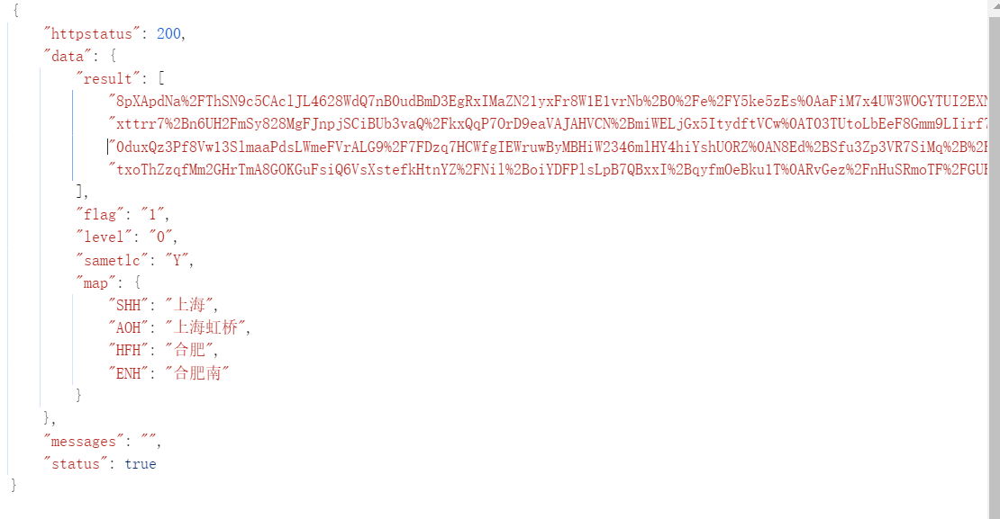

**注：如果访问对应链接时没有获取到对应的json字符串，请通过设置请求的cookie试试。**

# 一、城市站名&三字码
```text
https://kyfw.12306.cn/otn/resources/js/framework/station_name.js?station_version=1.9320
```

该链接返回的即是字符串，大体格式如上所示，根据上面的分隔符切分保存到数据库即可。

# 一、站点车次列表URL
**站点车次列表URL分析**
```tex
https://kyfw.12306.cn/otn/leftTicket/query?leftTicketDTO.train_date=2024-09-09&leftTicketDTO.from_station=HFH&leftTicketDTO.to_station=SHH&purpose_codes=ADULT
```
**变量使用#{parameter}标注**
```tex
https://kyfw.12306.cn/otn/leftTicket/query?leftTicketDTO.train_date=#{train_date}&leftTicketDTO.from_station=#{from_station}&leftTicketDTO.to_station=#{to_station}&purpose_codes=ADULT
```


通过上面的格式即可以得到车次列表的URL，然后使用station_info里的station_code进行替换，日期随便使用一个即可得到车次列表的URL。得到这个车次列表的信息后，我们可以解析当前车次的数据。
注意有些车次刚开始的车次名是A，在行驶过程中车次名可能变成B，这种情况需要注意。

这个数据可以使用JSON格式解析，得到车次列表的详细信息。只需要关注data里的result部分数据即可。取出result中的一行数据进行分析。

```text
"8pXApdNa%2FThSN9c5CAclJL4628WdQ7nB0udBmD3EgRxIMaZN21yxFr8W1E1vrNb%2B0%2Fe%2FY5ke5zEs%0AaFiM7x4UW3WOGYTUI2EXNLFiYyTmYNAA0aSePBVwNpU2hlZjuI83g5SdUlQnLGSRceKrDOOHHYyg%0AQ7X%2FX%2Fk37UqjAkCtippVyS5g38r%2B26njsH277WF1GbIh0Uk%2FsTQtAsuBXBRYeJHmqZ75IBvN1RK5%0ABkLcHldv41DW19NMASd%2FgCBo1uEHwh78ro9Lyll%2BeJFIqQAnT2bkVziSKK6tVN2nVukdrh66o8AE%0A3RW1FhCiaEe3of9qIxQLkT1B3offK5%2FixI5UjX4P7M1ef6Ip90zyzw%3D%3D|预订|53000G923100|G9234|BNU|AOH|HFH|AOH|20:43|23:31|02:48|Y|dkI5%2FPzp%2BSCeLK%2BS8kpoUzF4t8ghYbl%2FH1YIsvyih7HUhOEVOfdMsgIgzL0%3D|20240909|3|H3|03|07|1|0|||||||有||||有|20|9||90M0O0W0|9MOO|1|0||9070300009M034400020O021500021O021503022|0|||||1|0#0#0#0#z#0#z#z||7|CHN,CHN|||N#N#||90086M0087O0087W0087|202408261230|"
```
**分析**
```text
"？|预订|         车次|车次  |始发站code|终到站code|出发站code|到达站code|出发时间|到达时间|耗时 |Y|？|出发日期 |？可能是乘客类型？|？|？|？|？|？|||||||"
"？|预订|53000G923100|G9234|BNU       |AOH      |HFH      |AOH      |20:43 |23:31 |02:48|Y|？|20240909|3             |H3|03|07|1|0 |||||||有||||有|20|9||90M0O0W0|9MOO|1|0||9070300009M034400020O021500021O021503022|0|||||1|0#0#0#0#z#0#z#z||7|CHN,CHN|||N#N#||90086M0087O0087W0087|202408261230|"
[2]  # 车次代号
[3]  # 车次
[4]  # 始发站代号
[5]  # 终达站代号
[6]  # 出发站代号
[7]  # 到达站代号
[8]  # 出发时间
[9]  # 到达时间
[10]  # 历时
[23] or '--'  # 软卧余票数
[26] or '--'  # 无座余票数
[28] or '--'  # 硬卧余票数
[29] or '--'  # 硬座余票数
[30] or '--'  # 二等座余票数
[31] or '--'  # 一等座余票数
[32] or '--'  # 商务/特等座余票数
```
将上述信息保存到数据库中即可。

# 三、经停站车次信息

**经停站url信息分析**
```tex
https://kyfw.12306.cn/otn/czxx/queryByTrainNo?train_no=53000G923100&from_station_telecode=HFH&to_station_telecode=AOH&depart_date=2024-09-14
```

**变量使用#{parameter}标注**

```text
https://kyfw.12306.cn/otn/czxx/queryByTrainNo?train_no=#{train_no}&from_station_telecode=#{from_station_code}&to_station_telecode=#{to_station_code}&depart_date=#{depart_date}
```
经停站信息主要需要四个参数，一个是train_no，一个是from_station_telecode，一个是to_station_telecode，一个是depart_date。


从上面的链接里可以取出经停站信息，解析json串即可。

因为对于经停站展示的是这个车次的所有站点信息，在车次列表中会返回对应车次的始发站和终到站，所以我们可以从车次列表返回的对应车次拿到始发站和终到站，然后拼接到经停站的URL中，得到经停站信息。

# 二、爬取逻辑处理
## 2.1 城市站点信息爬取
提供一个controller接口，访问该接口时就爬取信息。如果该信息存在数据库中，就更新，不存在就插入。
注意：因为一直爬取可能容易导致封IP，所以这个接口爬取到数据后，可以不在使用，后续通过配置来决定是否启用该接口（todo）。

## 2.2 车次列表爬取
在访问车次列表的URL时，不设置cookie会得不到json串，所以需要设置cookie。
获取到数据后，解析json串，然后保存到数据库。

同样是提供一个controller接口，接口需要传入参数：出发日期，出发站，到达站，然后根据这些信息查询车次列表写入到数据库中。

## 2.3 经停站爬取
因为经停站信息的拼接需要依赖始发站和终到站，始发站和终到站的信息我们可以通过车次列表的信息获取，所以我们可以设置一个job来定时扫描车次列表爬取的数据，
然后拼接对应URL，获取经停站信息，然后保存到数据库。

# 三、改进点
1.刚开始为了看如果不建索引和建索引访问数据的差异，数据库表暂时未建索引，后续需要建立索引！！！
2.刚开始只是为了爬取数据，未使用缓存，后续可以考虑使用缓存保存从数据库中读取的数据。
3.现在所有的信息都在一个booking_order项目中，后续考虑拆分项目，
比如：爬取数据的项目、查询车次列表的项目、预订项目、job项目等，这样就不需要所有的项目耦合到一起了。
拆分项目后可以考虑通过Dubbo服务来访问对应服务。
4.提高配置的灵活性，后续考虑使用nacos来管理配置。
5.下单时熔断、降级、限流方案？
6.下单成功后的展示？
7.分库分表？
8.使用docker,k8s等容器部署项目？
